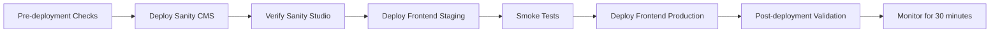

# ElPortal Deployment & Release Coordination Strategy

## Overview

This document outlines the deployment and release processes for the ElPortal ecosystem, ensuring coordinated releases between the frontend (elportal-forside-design) and CMS (sanityelpriscms) projects.

## 1. Release Planning

### 1.1 Release Cadence

```
Production Releases:
├── Major Release: Monthly (1st Tuesday)
├── Minor Release: Bi-weekly (Alternate Tuesdays)
├── Patch Release: As needed
└── Hotfix: Immediate (critical issues only)

Release Windows:
├── Scheduled: 10:00-12:00 CET (low traffic)
├── Emergency: Any time (with approval)
└── Blackout: December 20-January 5 (holiday freeze)
```

### 1.2 Release Types

#### Major Release (x.0.0)
- Breaking changes allowed
- Schema migrations required
- Full regression testing
- 2-week notice to stakeholders
- Coordinated marketing announcement

#### Minor Release (x.y.0)
- New features
- Non-breaking schema changes
- Integration testing required
- 1-week notice to team
- Release notes published

#### Patch Release (x.y.z)
- Bug fixes only
- No schema changes
- Targeted testing
- Same-day deployment allowed
- Changelog update

#### Hotfix Release
- Critical production issues
- Minimal change scope
- Emergency approval process
- Immediate deployment
- Post-mortem required

## 2. Pre-Release Checklist

### 2.1 One Week Before Release

```yaml
# release-prep-checklist.yml
- [ ] Feature freeze announced
- [ ] Release branch created in both repos
- [ ] Schema changes documented
- [ ] Migration scripts prepared
- [ ] Test environments updated
- [ ] QA testing started
- [ ] Release notes drafted
- [ ] Stakeholders notified
```

### 2.2 One Day Before Release

```yaml
# pre-release-checklist.yml
- [ ] All tests passing in both projects
- [ ] Type synchronization verified
- [ ] Content blocks validated
- [ ] Performance benchmarks met
- [ ] Security scan completed
- [ ] Rollback plan documented
- [ ] Team availability confirmed
- [ ] Monitoring alerts configured
```

## 3. Deployment Process

### 3.1 Standard Deployment Flow



### 3.2 Deployment Scripts

#### Automated Deployment Pipeline

```bash
#!/bin/bash
# scripts/deploy-release.sh

set -e

RELEASE_VERSION=$1
DRY_RUN=${2:-false}

echo "🚀 ElPortal Release Deployment v${RELEASE_VERSION}"
echo "================================================"

# 1. Pre-flight checks
echo "✅ Running pre-flight checks..."
./scripts/preflight-check.sh || exit 1

# 2. Tag repositories
echo "🏷️  Tagging repositories..."
cd ../sanityelpriscms
git tag -a "v${RELEASE_VERSION}" -m "Release v${RELEASE_VERSION}"
cd ../elportal-forside-design
git tag -a "v${RELEASE_VERSION}" -m "Release v${RELEASE_VERSION}"

if [ "$DRY_RUN" == "true" ]; then
    echo "🔍 DRY RUN - Skipping actual deployment"
    exit 0
fi

# 3. Deploy Sanity
echo "📤 Deploying Sanity CMS..."
cd ../sanityelpriscms
npm run deploy:production

# 4. Wait for CDN propagation
echo "⏳ Waiting for CDN propagation (60s)..."
sleep 60

# 5. Deploy Frontend to Staging
echo "🔧 Deploying to staging..."
cd ../elportal-forside-design
npm run deploy:staging

# 6. Run smoke tests
echo "🧪 Running smoke tests..."
npm run test:staging

# 7. Deploy to Production
echo "🌍 Deploying to production..."
npm run deploy:production

# 8. Verify deployment
echo "✅ Verifying deployment..."
./scripts/verify-deployment.sh

echo "✨ Deployment complete!"
```

#### Pre-flight Check Script

```typescript
// scripts/preflight-check.ts
import { execSync } from 'child_process';
import chalk from 'chalk';

interface CheckResult {
  passed: boolean;
  message: string;
}

const checks: Array<() => CheckResult> = [
  // Check 1: Git status
  () => {
    const status = execSync('git status --porcelain').toString();
    return {
      passed: status.length === 0,
      message: 'Working directory clean'
    };
  },
  
  // Check 2: Tests passing
  () => {
    try {
      execSync('npm test', { stdio: 'pipe' });
      return { passed: true, message: 'All tests passing' };
    } catch {
      return { passed: false, message: 'Tests failing' };
    }
  },
  
  // Check 3: Build successful
  () => {
    try {
      execSync('npm run build', { stdio: 'pipe' });
      return { passed: true, message: 'Build successful' };
    } catch {
      return { passed: false, message: 'Build failed' };
    }
  },
  
  // Check 4: Type sync
  () => {
    const typesAge = Date.now() - statSync('src/types/sanity.ts').mtimeMs;
    const fresh = typesAge < 60 * 60 * 1000; // 1 hour
    return {
      passed: fresh,
      message: fresh ? 'Types are fresh' : 'Types need regeneration'
    };
  },
  
  // Check 5: Schema validation
  () => {
    try {
      execSync('npm run validate:schemas', { stdio: 'pipe' });
      return { passed: true, message: 'Schemas valid' };
    } catch {
      return { passed: false, message: 'Schema validation failed' };
    }
  }
];

// Run all checks
console.log('Running pre-flight checks...\n');
let allPassed = true;

for (const check of checks) {
  const result = check();
  const icon = result.passed ? '✅' : '❌';
  const color = result.passed ? chalk.green : chalk.red;
  console.log(`${icon} ${color(result.message)}`);
  if (!result.passed) allPassed = false;
}

process.exit(allPassed ? 0 : 1);
```

### 3.3 Environment-Specific Deployments

#### Staging Deployment

```yaml
# .github/workflows/deploy-staging.yml
name: Deploy to Staging

on:
  push:
    branches: [staging]

jobs:
  deploy:
    runs-on: ubuntu-latest
    steps:
      - uses: actions/checkout@v3
      
      - name: Deploy Sanity to Staging
        run: |
          cd sanityelpriscms
          npm ci
          npm run deploy:staging
        env:
          SANITY_AUTH_TOKEN: ${{ secrets.SANITY_AUTH_TOKEN }}
      
      - name: Deploy Frontend to Staging
        run: |
          npm ci
          npm run build
          vercel --prod --env=staging
        env:
          VERCEL_TOKEN: ${{ secrets.VERCEL_TOKEN }}
```

#### Production Deployment

```yaml
# .github/workflows/deploy-production.yml
name: Deploy to Production

on:
  release:
    types: [published]

jobs:
  deploy:
    runs-on: ubuntu-latest
    environment: production
    steps:
      - uses: actions/checkout@v3
        with:
          ref: ${{ github.event.release.tag_name }}
      
      - name: Deploy Sanity
        run: |
          cd sanityelpriscms
          npm ci
          npm run deploy:production
      
      - name: Deploy Frontend
        run: |
          npm ci
          npm run build
          vercel --prod
      
      - name: Notify Success
        uses: 8398a7/action-slack@v3
        with:
          status: success
          text: 'Production deployment successful! 🎉'
```

## 4. Rollback Procedures

### 4.1 Rollback Decision Matrix

| Issue Type | Severity | Rollback Time | Approval Required |
|------------|----------|---------------|-------------------|
| Data corruption | Critical | Immediate | CTO |
| Feature broken | High | < 30 min | Tech Lead |
| Performance degradation | Medium | < 2 hours | Team Lead |
| Minor bug | Low | Next release | None |

### 4.2 Rollback Scripts

#### Quick Rollback (Frontend Only)

```bash
#!/bin/bash
# scripts/rollback-frontend.sh

PREVIOUS_VERSION=$1

echo "🔄 Rolling back frontend to v${PREVIOUS_VERSION}..."

# Vercel instant rollback
vercel rollback --yes

# Clear CDN cache
curl -X POST https://api.vercel.com/v1/purge \
  -H "Authorization: Bearer $VERCEL_TOKEN" \
  -d '{"urls": ["/*"]}'

echo "✅ Frontend rolled back successfully"
```

#### Full Rollback (Both Projects)

```typescript
// scripts/rollback-full.ts
import { rollbackFrontend, rollbackSanity } from './rollback-utils';

async function fullRollback(version: string) {
  console.log(`🔄 Full rollback to v${version} initiated...`);
  
  try {
    // 1. Rollback frontend first (instant)
    await rollbackFrontend(version);
    console.log('✅ Frontend rolled back');
    
    // 2. Restore Sanity dataset
    const backupName = `production-backup-v${version}`;
    await rollbackSanity(backupName);
    console.log('✅ Sanity dataset restored');
    
    // 3. Clear all caches
    await clearAllCaches();
    console.log('✅ Caches cleared');
    
    // 4. Verify rollback
    const health = await checkSystemHealth();
    if (!health.allHealthy) {
      throw new Error('System health check failed after rollback');
    }
    
    console.log('✨ Rollback completed successfully');
  } catch (error) {
    console.error('❌ Rollback failed:', error);
    // Trigger emergency alert
    await sendEmergencyAlert(error);
  }
}
```

## 5. Release Communication

### 5.1 Release Notes Template

```markdown
# Release v[X.Y.Z] - [Release Name]

**Release Date**: [Date]
**Release Type**: [Major|Minor|Patch]

## 🎯 Highlights
- Key feature or improvement 1
- Key feature or improvement 2
- Key feature or improvement 3

## ✨ New Features
### Feature Name
- Description of the feature
- How it benefits users
- Any configuration needed

## 🐛 Bug Fixes
- Fixed issue with [component] when [condition]
- Resolved error in [feature] that caused [problem]

## 🔧 Technical Improvements
- Performance optimization in [area]
- Refactored [component] for better maintainability
- Updated dependencies for security

## 💔 Breaking Changes
- [If applicable] Description of breaking change
- Migration instructions

## 📊 Performance Impact
- Page load time: -X%
- Bundle size: +/-X KB
- API response time: -X ms

## 🚀 Deployment Notes
- Deployment window: [Time]
- Expected downtime: None
- Rollback plan: Available

## 📝 For Developers
- New environment variables: [If any]
- Schema changes: [If any]
- API changes: [If any]
```

### 5.2 Stakeholder Communication

#### Pre-Release Email

```
Subject: ElPortal Release v[X.Y.Z] - [Date]

Hi team,

We're planning to release ElPortal v[X.Y.Z] on [Date] at [Time] CET.

Key updates:
• [Major feature/fix 1]
• [Major feature/fix 2]
• [Major feature/fix 3]

Expected impact:
• No downtime expected
• Performance improvements of X%
• New features available immediately

Action required:
• Content team: Review new components in Sanity Studio
• Support team: Familiarize with new features
• Marketing: Prepare announcement if needed

Full release notes: [Link]

Best regards,
ElPortal Development Team
```

## 6. Post-Release Procedures

### 6.1 Monitoring Dashboard

```typescript
// monitoring/release-dashboard.ts
interface ReleaseMetrics {
  errorRate: number;
  responseTime: number;
  activeUsers: number;
  apiCalls: number;
  cacheHitRate: number;
}

class ReleaseMonitor {
  private metrics: ReleaseMetrics[] = [];
  private baseline: ReleaseMetrics;
  
  async startMonitoring(releaseVersion: string) {
    console.log(`📊 Monitoring release v${releaseVersion}`);
    
    // Capture baseline
    this.baseline = await this.captureMetrics();
    
    // Monitor for 30 minutes
    const interval = setInterval(async () => {
      const current = await this.captureMetrics();
      this.metrics.push(current);
      
      // Check for anomalies
      if (this.detectAnomaly(current)) {
        await this.triggerAlert(current);
      }
      
      // Display dashboard
      this.displayDashboard(current);
    }, 60000); // Every minute
    
    // Stop after 30 minutes
    setTimeout(() => {
      clearInterval(interval);
      this.generateReport();
    }, 30 * 60 * 1000);
  }
  
  private detectAnomaly(current: ReleaseMetrics): boolean {
    return (
      current.errorRate > this.baseline.errorRate * 1.5 ||
      current.responseTime > this.baseline.responseTime * 2 ||
      current.activeUsers < this.baseline.activeUsers * 0.5
    );
  }
}
```

### 6.2 Success Criteria

```yaml
# release-success-criteria.yml
performance:
  - metric: error_rate
    threshold: < 0.5%
    window: 30_minutes
  
  - metric: response_time_p95
    threshold: < 500ms
    window: 30_minutes
  
  - metric: availability
    threshold: > 99.9%
    window: 24_hours

functionality:
  - all_endpoints_responding: true
  - sanity_content_loading: true
  - price_calculations_accurate: true
  - provider_sorting_correct: true

user_experience:
  - page_load_time: < 3s
  - interactive_time: < 5s
  - no_console_errors: true
  - mobile_responsive: true
```

## 7. Emergency Procedures

### 7.1 Emergency Contact List

```yaml
# emergency-contacts.yml
on_call_rotation:
  primary:
    name: Tech Lead
    phone: +45-XXXX-XXXX
    slack: @techlead
  
  secondary:
    name: Senior Developer
    phone: +45-YYYY-YYYY
    slack: @seniordev
  
  escalation:
    name: CTO
    phone: +45-ZZZZ-ZZZZ
    slack: @cto

external_contacts:
  vercel_support: support@vercel.com
  sanity_support: support@sanity.io
```

### 7.2 Emergency Response Playbook

```markdown
# Emergency Response Playbook

## 🚨 Critical Issue Detected

1. **Assess Impact** (< 5 minutes)
   - Check monitoring dashboard
   - Verify user reports
   - Determine scope of issue

2. **Immediate Response** (< 10 minutes)
   - If data corruption: Disable writes
   - If performance: Scale resources
   - If errors: Enable maintenance mode

3. **Communication** (< 15 minutes)
   - Notify on-call team
   - Update status page
   - Inform stakeholders

4. **Resolution** (< 30 minutes)
   - Attempt hotfix
   - If unsuccessful: Rollback
   - Document all actions

5. **Post-Incident** (< 24 hours)
   - Root cause analysis
   - Update playbook
   - Schedule post-mortem
```

## 8. Continuous Improvement

### 8.1 Release Retrospective Template

```markdown
# Release Retrospective v[X.Y.Z]

## 📊 Metrics
- Deployment duration: X minutes
- Issues encountered: Y
- Rollbacks needed: Yes/No
- User impact: None/Minor/Major

## ✅ What Went Well
- [Success 1]
- [Success 2]

## ❌ What Could Be Improved
- [Issue 1]
- [Issue 2]

## 📝 Action Items
- [ ] [Improvement 1] - Owner: @person
- [ ] [Improvement 2] - Owner: @person

## 🎯 Next Release Goals
- Reduce deployment time by X%
- Automate [manual process]
- Improve [specific area]
```

### 8.2 Process Evolution

```typescript
// Track deployment metrics over time
interface DeploymentMetrics {
  version: string;
  duration: number;
  success: boolean;
  issues: string[];
  rollback: boolean;
}

class DeploymentAnalytics {
  analyze(deployments: DeploymentMetrics[]) {
    const trends = {
      avgDuration: this.calculateAverage(deployments, 'd.duration'),
      successRate: this.calculateSuccessRate(deployments),
      commonIssues: this.findCommonIssues(deployments),
      improvements: this.suggestImprovements(deployments)
    };
    
    return trends;
  }
}
```

## 9. Automation Roadmap

### 9.1 Current State vs Future State

```
Current State (Manual):
├── Manual version tagging
├── Sequential deployment
├── Manual smoke tests
├── Manual rollback
└── Manual monitoring

Future State (Automated):
├── Auto-tagging on merge
├── Parallel deployment pipeline
├── Automated test suite
├── One-click rollback
└── AI-powered monitoring
```

### 9.2 Automation Implementation Plan

```yaml
# automation-roadmap.yml
phase_1_q1:
  - automated_version_tagging
  - basic_smoke_tests
  - deployment_notifications

phase_2_q2:
  - parallel_deployments
  - automated_rollback
  - performance_testing

phase_3_q3:
  - canary_deployments
  - feature_flags
  - a_b_testing

phase_4_q4:
  - blue_green_deployments
  - auto_scaling
  - predictive_monitoring
```

---

*This deployment and release strategy ensures safe, coordinated releases across the ElPortal ecosystem. Regular reviews and updates keep the process efficient and reliable.*