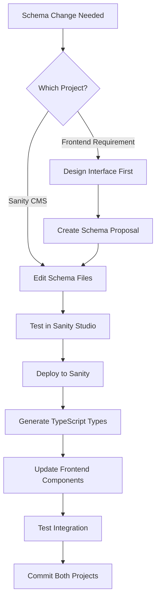

# ElPortal Project Synchronization Workflows

## Overview

This document provides detailed workflows for keeping the elportal-forside-design (frontend) and sanityelpriscms (CMS) projects synchronized during development, deployment, and maintenance.

## 1. Daily Development Synchronization

### 1.1 Morning Sync Routine

```bash
#!/bin/bash
# Morning sync script - save as scripts/morning-sync.sh

echo "🌅 Starting ElPortal morning sync..."

# 1. Update both repositories
echo "📥 Pulling latest changes..."
cd ~/Desktop/projects/sanityelpriscms && git pull
cd ~/Desktop/projects/elportal-forside-design && git pull

# 2. Install any new dependencies
echo "📦 Checking dependencies..."
cd ~/Desktop/projects/sanityelpriscms && npm ci
cd ~/Desktop/projects/elportal-forside-design && npm ci

# 3. Check for schema changes
echo "🔍 Checking for schema changes..."
cd ~/Desktop/projects/sanityelpriscms
SCHEMA_HASH=$(find schemaTypes -type f -name "*.ts" -exec md5sum {} \; | sort -k 2 | md5sum)
LAST_HASH=$(cat .schema-hash 2>/dev/null || echo "none")

if [ "$SCHEMA_HASH" != "$LAST_HASH" ]; then
    echo "⚠️  Schema changes detected! Regenerating types..."
    cd ~/Desktop/projects/elportal-forside-design
    npm run generate:types
    echo "$SCHEMA_HASH" > ~/Desktop/projects/sanityelpriscms/.schema-hash
fi

# 4. Start development servers
echo "🚀 Starting development servers..."
osascript -e 'tell app "Terminal" to do script "cd ~/Desktop/projects/sanityelpriscms && npm run dev"'
osascript -e 'tell app "Terminal" to do script "cd ~/Desktop/projects/elportal-forside-design && npm run dev"'

echo "✅ Morning sync complete!"
```

### 1.2 Pre-Commit Synchronization

```bash
#!/bin/bash
# Pre-commit hook - save as .git/hooks/pre-commit in both repos

# Check if we're in sync
FRONTEND_DIR="~/Desktop/projects/elportal-forside-design"
CMS_DIR="~/Desktop/projects/sanityelpriscms"

# For CMS commits - check if types need regeneration
if [[ $PWD == *"sanityelpriscms"* ]]; then
    echo "Checking for schema changes..."
    if git diff --cached --name-only | grep -q "schemaTypes/"; then
        echo "⚠️  Schema changes detected!"
        echo "Remember to regenerate types in frontend after committing:"
        echo "cd $FRONTEND_DIR && npm run generate:types"
    fi
fi

# For Frontend commits - check type freshness
if [[ $PWD == *"elportal-forside-design"* ]]; then
    if [ -f "src/types/sanity.ts" ]; then
        TYPES_AGE=$(find src/types/sanity.ts -mtime +1 | wc -l)
        if [ $TYPES_AGE -gt 0 ]; then
            echo "⚠️  Sanity types are more than 1 day old!"
            echo "Consider regenerating: npm run generate:types"
        fi
    fi
fi
```

## 2. Schema Synchronization Workflow

### 2.1 Schema Change Process



### 2.2 Automated Schema Sync Script

```typescript
// scripts/sync-schema.ts
import { execSync } from 'child_process';
import { createHash } from 'crypto';
import { readFileSync, writeFileSync } from 'fs';
import { glob } from 'glob';

async function syncSchema() {
  console.log('🔄 Starting schema synchronization...');
  
  // 1. Calculate schema hash
  const schemaFiles = await glob('schemaTypes/**/*.ts', {
    cwd: '../sanityelpriscms'
  });
  
  const schemaHash = createHash('md5');
  for (const file of schemaFiles) {
    const content = readFileSync(`../sanityelpriscms/${file}`, 'utf8');
    schemaHash.update(content);
  }
  
  const currentHash = schemaHash.digest('hex');
  const hashFile = '.schema-sync-hash';
  
  try {
    const lastHash = readFileSync(hashFile, 'utf8');
    if (currentHash === lastHash) {
      console.log('✅ Schemas are in sync!');
      return;
    }
  } catch {
    // First run
  }
  
  // 2. Deploy Sanity changes
  console.log('📤 Deploying Sanity changes...');
  execSync('cd ../sanityelpriscms && sanity deploy', { stdio: 'inherit' });
  
  // 3. Generate types
  console.log('🏗️ Generating TypeScript types...');
  execSync('npm run generate:types', { stdio: 'inherit' });
  
  // 4. Validate generated types
  console.log('✅ Validating types...');
  execSync('npm run type-check', { stdio: 'inherit' });
  
  // 5. Update hash
  writeFileSync(hashFile, currentHash);
  
  console.log('✨ Schema synchronization complete!');
}

syncSchema().catch(console.error);
```

## 3. Content Block Synchronization

### 3.1 New Content Block Workflow

```yaml
# .github/workflows/content-block-sync.yml
name: Content Block Sync Check

on:
  pull_request:
    paths:
      - 'sanityelpriscms/schemaTypes/**'
      - 'elportal-forside-design/src/components/**'

jobs:
  check-sync:
    runs-on: ubuntu-latest
    steps:
      - name: Check Content Block Sync
        run: |
          # Check if both ContentBlocks.tsx and SafeContentBlocks.tsx are updated
          if git diff --name-only origin/main..HEAD | grep -q "schemaTypes/"; then
            if ! git diff --name-only origin/main..HEAD | grep -q "ContentBlocks.tsx"; then
              echo "❌ ContentBlocks.tsx not updated!"
              exit 1
            fi
            if ! git diff --name-only origin/main..HEAD | grep -q "SafeContentBlocks.tsx"; then
              echo "❌ SafeContentBlocks.tsx not updated!"
              exit 1
            fi
          fi
```

### 3.2 Content Block Validation Script

```typescript
// scripts/validate-content-blocks.ts
import { readdirSync, readFileSync } from 'fs';

function validateContentBlocks() {
  // 1. Get all Sanity content block schemas
  const schemaDir = '../sanityelpriscms/schemaTypes';
  const schemas = readdirSync(schemaDir)
    .filter(f => f.endsWith('.ts'))
    .map(f => readFileSync(`${schemaDir}/${f}`, 'utf8'));
  
  const contentBlockTypes = new Set<string>();
  schemas.forEach(schema => {
    const matches = schema.match(/name:\s*['"]([^'"]+)['"]/g);
    if (matches) {
      matches.forEach(match => {
        const type = match.match(/['"]([^'"]+)['"]/)?.[1];
        if (type) contentBlockTypes.add(type);
      });
    }
  });
  
  // 2. Check ContentBlocks.tsx
  const contentBlocks = readFileSync('src/components/ContentBlocks.tsx', 'utf8');
  const safeContentBlocks = readFileSync('src/components/SafeContentBlocks.tsx', 'utf8');
  
  const missingInMain: string[] = [];
  const missingInSafe: string[] = [];
  
  contentBlockTypes.forEach(type => {
    if (!contentBlocks.includes(`case '${type}':`)) {
      missingInMain.push(type);
    }
    if (!safeContentBlocks.includes(`case '${type}':`)) {
      missingInSafe.push(type);
    }
  });
  
  // 3. Report findings
  if (missingInMain.length > 0) {
    console.error('❌ Missing in ContentBlocks.tsx:', missingInMain);
  }
  if (missingInSafe.length > 0) {
    console.error('❌ Missing in SafeContentBlocks.tsx:', missingInSafe);
  }
  
  if (missingInMain.length === 0 && missingInSafe.length === 0) {
    console.log('✅ All content blocks are properly synchronized!');
  }
  
  return missingInMain.length === 0 && missingInSafe.length === 0;
}

process.exit(validateContentBlocks() ? 0 : 1);
```

## 4. API Integration Synchronization

### 4.1 API Response Type Sync

```typescript
// scripts/sync-api-types.ts
import { writeFileSync } from 'fs';

async function syncApiTypes() {
  // 1. Fetch current API schemas
  const energiDataSchema = await fetch(
    'https://api.energidataservice.dk/meta/dataset/Elspotprices'
  ).then(r => r.json());
  
  // 2. Generate TypeScript interfaces
  const types = `
// Auto-generated API types - DO NOT EDIT
// Last updated: ${new Date().toISOString()}

export interface ElspotPrice {
  HourUTC: string;
  HourDK: string;
  PriceArea: 'DK1' | 'DK2';
  SpotPriceDKK: number;
  SpotPriceEUR: number;
}

export interface ProductionData {
  Minutes5UTC: string;
  PriceArea: 'DK1' | 'DK2';
  ProductionGe100MW: number;
  ProductionLt100MW: number;
  SolarPower: number;
  OnshoreWindPower: number;
  OffshoreWindPower: number;
}
`;
  
  writeFileSync('src/types/api.ts', types);
  console.log('✅ API types synchronized');
}
```

### 4.2 API Mock Data Sync

```typescript
// scripts/generate-mock-data.ts
async function generateMockData() {
  // Fetch real data samples
  const realData = await fetch(
    'https://api.energidataservice.dk/dataset/Elspotprices?limit=24'
  ).then(r => r.json());
  
  // Generate mock data based on real structure
  const mockData = {
    records: realData.records.map((record: any) => ({
      ...record,
      SpotPriceDKK: Math.random() * 500 + 100 // Randomize for testing
    }))
  };
  
  writeFileSync(
    'src/mocks/elspotprices.json',
    JSON.stringify(mockData, null, 2)
  );
}
```

## 5. Deployment Synchronization

### 5.1 Coordinated Deployment Script

```bash
#!/bin/bash
# scripts/deploy-both.sh

echo "🚀 Starting coordinated deployment..."

# 1. Run tests in both projects
echo "🧪 Running tests..."
cd ~/Desktop/projects/sanityelpriscms && npm test
cd ~/Desktop/projects/elportal-forside-design && npm test

# 2. Build frontend to ensure compatibility
echo "🏗️ Building frontend..."
cd ~/Desktop/projects/elportal-forside-design && npm run build

# 3. Deploy Sanity first (instant)
echo "📤 Deploying Sanity CMS..."
cd ~/Desktop/projects/sanityelpriscms && sanity deploy

# 4. Wait for Sanity CDN propagation
echo "⏳ Waiting for CDN propagation (30s)..."
sleep 30

# 5. Deploy frontend
echo "🌐 Deploying frontend..."
cd ~/Desktop/projects/elportal-forside-design && npm run deploy

# 6. Run smoke tests
echo "🔥 Running smoke tests..."
npm run test:e2e -- --smoke

echo "✅ Deployment complete!"
```

### 5.2 Rollback Coordination

```typescript
// scripts/coordinated-rollback.ts
async function rollback(version: string) {
  console.log(`🔄 Rolling back to version ${version}...`);
  
  // 1. Rollback frontend first (instant on Vercel)
  await exec(`vercel rollback ${version}`);
  
  // 2. Restore Sanity dataset
  const datasetBackup = `production-${version}`;
  await exec(`sanity dataset import ${datasetBackup}.tar.gz production`);
  
  // 3. Clear CDN caches
  await fetch('https://api.sanity.io/v1/cache/purge', {
    method: 'POST',
    headers: {
      'Authorization': `Bearer ${process.env.SANITY_API_TOKEN}`
    }
  });
  
  console.log('✅ Rollback complete');
}
```

## 6. Monitoring Synchronization

### 6.1 Health Check Dashboard

```typescript
// scripts/health-check.ts
async function checkSystemHealth() {
  const checks = {
    sanityStudio: false,
    sanityApi: false,
    frontend: false,
    apiIntegration: false,
    typeSync: false
  };
  
  // Check Sanity Studio
  try {
    const studioRes = await fetch('https://dinelportal.sanity.studio');
    checks.sanityStudio = studioRes.ok;
  } catch {}
  
  // Check Sanity API
  try {
    const apiRes = await fetch(
      `https://${PROJECT_ID}.api.sanity.io/v2021-06-07/data/query/production?query=*[_type=="homePage"][0]`
    );
    checks.sanityApi = apiRes.ok;
  } catch {}
  
  // Check Frontend
  try {
    const frontendRes = await fetch('https://elportal.dk');
    checks.frontend = frontendRes.ok;
  } catch {}
  
  // Check API Integration
  try {
    const apiRes = await fetch('https://elportal.dk/api/prices');
    checks.apiIntegration = apiRes.ok;
  } catch {}
  
  // Check Type Sync
  const typesAge = Date.now() - statSync('src/types/sanity.ts').mtimeMs;
  checks.typeSync = typesAge < 24 * 60 * 60 * 1000; // Less than 1 day old
  
  return checks;
}
```

### 6.2 Sync Status Reporter

```typescript
// scripts/sync-status.ts
interface SyncStatus {
  lastSchemaChange: Date;
  lastTypeGeneration: Date;
  lastDeployment: {
    sanity: Date;
    frontend: Date;
  };
  pendingChanges: {
    sanity: string[];
    frontend: string[];
  };
}

async function reportSyncStatus(): Promise<SyncStatus> {
  const status: SyncStatus = {
    lastSchemaChange: await getLastSchemaChange(),
    lastTypeGeneration: await getLastTypeGeneration(),
    lastDeployment: {
      sanity: await getSanityDeploymentTime(),
      frontend: await getFrontendDeploymentTime()
    },
    pendingChanges: {
      sanity: await getPendingChanges('../sanityelpriscms'),
      frontend: await getPendingChanges('.')
    }
  };
  
  // Generate report
  console.log('📊 Sync Status Report');
  console.log('====================');
  console.log(`Schema last changed: ${status.lastSchemaChange}`);
  console.log(`Types last generated: ${status.lastTypeGeneration}`);
  console.log(`Type sync status: ${
    status.lastTypeGeneration > status.lastSchemaChange ? '✅' : '⚠️ Out of sync'
  }`);
  console.log(`\nLast Deployments:`);
  console.log(`  Sanity: ${status.lastDeployment.sanity}`);
  console.log(`  Frontend: ${status.lastDeployment.frontend}`);
  console.log(`\nPending Changes:`);
  console.log(`  Sanity: ${status.pendingChanges.sanity.length} files`);
  console.log(`  Frontend: ${status.pendingChanges.frontend.length} files`);
  
  return status;
}
```

## 7. Emergency Synchronization Procedures

### 7.1 Schema Mismatch Recovery

```bash
#!/bin/bash
# scripts/fix-schema-mismatch.sh

echo "🚨 Emergency schema sync initiated..."

# 1. Backup current state
echo "💾 Creating backups..."
cd ~/Desktop/projects/sanityelpriscms
sanity dataset export production backup-$(date +%Y%m%d-%H%M%S).tar.gz

# 2. Get schema from production
echo "📥 Fetching production schema..."
sanity schema extract

# 3. Regenerate all types
echo "🔄 Regenerating types..."
cd ~/Desktop/projects/elportal-forside-design
npm run generate:types -- --force

# 4. Validate compatibility
echo "✅ Validating..."
npm run build

echo "✨ Schema sync recovered!"
```

### 7.2 Content Block Mismatch Fix

```typescript
// scripts/fix-content-blocks.ts
async function fixContentBlockMismatch() {
  // 1. Scan for all content block types in Sanity
  const sanityBlocks = await getSanityContentBlocks();
  
  // 2. Scan both renderers
  const mainBlocks = getBlocksFromFile('ContentBlocks.tsx');
  const safeBlocks = getBlocksFromFile('SafeContentBlocks.tsx');
  
  // 3. Find mismatches
  const missingInMain = sanityBlocks.filter(b => !mainBlocks.has(b));
  const missingInSafe = sanityBlocks.filter(b => !safeBlocks.has(b));
  
  // 4. Generate fix patches
  if (missingInMain.length > 0) {
    generatePatch('ContentBlocks.tsx', missingInMain);
  }
  
  if (missingInSafe.length > 0) {
    generatePatch('SafeContentBlocks.tsx', missingInSafe);
  }
  
  console.log('✅ Content blocks synchronized!');
}
```

## 8. Best Practices Checklist

### Daily Development
- [ ] Run morning sync script
- [ ] Check for schema changes before starting work
- [ ] Use feature branches in both projects
- [ ] Test integration after changes
- [ ] Commit related changes together

### Before Deployment
- [ ] Ensure types are freshly generated
- [ ] Run integration tests
- [ ] Check all content blocks are synced
- [ ] Verify API compatibility
- [ ] Document breaking changes

### After Schema Changes
- [ ] Deploy to Sanity immediately
- [ ] Generate new types
- [ ] Update affected components
- [ ] Test both renderers
- [ ] Update documentation

### Weekly Maintenance
- [ ] Run full sync validation
- [ ] Check for type drift
- [ ] Review error logs
- [ ] Update sync scripts
- [ ] Clean up old branches

## 9. Automation Setup

### 9.1 GitHub Actions Integration

```yaml
# .github/workflows/sync-check.yml
name: Project Sync Check

on:
  push:
    branches: [main, develop]
  pull_request:
    branches: [main]

jobs:
  sync-check:
    runs-on: ubuntu-latest
    steps:
      - uses: actions/checkout@v3
        with:
          path: frontend
          
      - uses: actions/checkout@v3
        with:
          repository: your-org/sanityelpriscms
          path: cms
          
      - name: Check Sync Status
        run: |
          cd frontend
          npm ci
          npm run sync:check -- --cms-path=../cms
```

### 9.2 Husky Hooks Setup

```json
// package.json (both projects)
{
  "husky": {
    "hooks": {
      "pre-commit": "npm run sync:validate",
      "pre-push": "npm run sync:check",
      "post-merge": "npm run sync:update"
    }
  }
}
```

## 10. Troubleshooting Guide

### Common Sync Issues

#### Types out of sync
```bash
# Quick fix
cd elportal-forside-design
npm run generate:types -- --force
```

#### Content blocks missing
```bash
# Validate and report
npm run validate:content-blocks
```

#### API mismatch
```bash
# Regenerate API types
npm run sync:api-types
```

#### Schema deployment failed
```bash
# Manual deployment
cd sanityelpriscms
sanity deploy --no-minify
```

---

*This workflow guide ensures smooth synchronization between the ElPortal frontend and Sanity CMS projects. Follow these workflows to maintain consistency and prevent integration issues.*